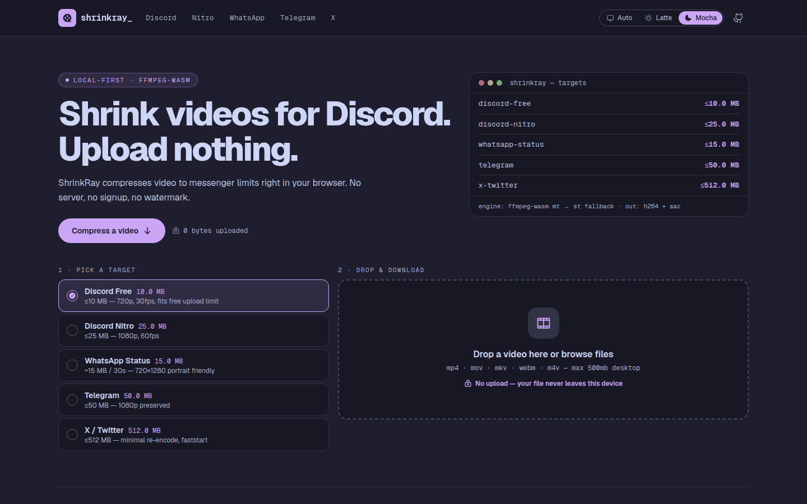
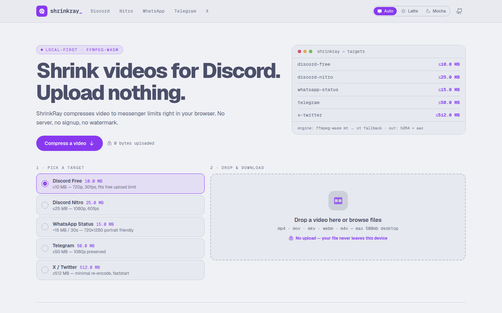
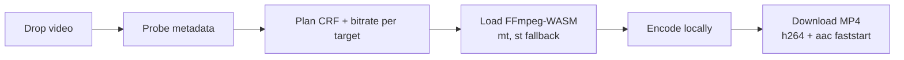

# ShrinkRay

> Compress video for **Discord / WhatsApp / Telegram / X** — 100% in your browser.
> No upload, no signup, no watermark. Your file never leaves your device.

[](LICENSE)


<p align="center">
  
  
  <br />
  <em>Catppuccin Mocha and Latte — follows your OS, switchable in the nav, or via <code>?flavour=mocha</code>.</em>
</p>

## Why

Messenger upload limits (Discord 10 MB free, Telegram 50 MB, WA Status…) push people
to upload private videos to random converter sites. ShrinkRay encodes locally with
FFmpeg-WASM instead — private by design, and free to host (static, no server bills).

The adaptive CRF planning engine is ported from
[adjust-quality](https://github.com/kiraadityaa/adjust-quality) (server-side FFmpeg)
and reworked for client-side encoding.

## Targets

| Target | Limit | Output cap | Page |
|---|---|---|---|
| Discord Free | ≤ 10 MB | 720p · 30fps | `/tools/discord-free` |
| Discord Nitro | ≤ 25 MB | 1080p · 60fps | `/tools/discord-nitro` |
| WhatsApp Status | ~15 MB / 30s | 720p portrait · 30fps | `/tools/whatsapp-status` |
| Telegram | ≤ 50 MB | 1080p · 60fps | `/tools/telegram` |
| X / Twitter | ≤ 512 MB | 1080p · minimal re-encode | `/tools/x-twitter` |

## How it works



- `src/lib/presets.ts` — the 5 messenger targets above
- `src/lib/plan.ts` — adaptive planner: never upscales, caps fps per target, retries with higher CRF until the size estimate fits
- `src/lib/analyze-client.ts` — browser metadata probe (no `ffprobe` binary client-side)
- `src/lib/wasm-loader.ts` — singleton loader: local `/ffmpeg/*` → CDN fallback, `core-mt` → `core-st`
- `src/lib/encode.ts` — runs the encode, reports progress, returns a `Blob`
- `src/lib/theme.ts` — Catppuccin flavour state (auto / latte / mocha)
- `src/components/compressor/*` — PresetRail, Dropzone, PlanReadout, EncodeProgress, ResultPanel

FFmpeg multithreading needs `SharedArrayBuffer`, hence the COOP/COEP headers
in `next.config.ts` + `vercel.json`. Safari/iOS falls back to single-thread.

## Quick start

Requirements: Node.js ≥ 20.

```bash
git clone https://github.com/kiraadityaa/shrinkray.git
cd shrinkray
npm install        # postinstall copies the FFmpeg cores to public/ffmpeg
npm run dev        # http://localhost:3000
```

## Scripts

| Script | Purpose |
|---|---|
| `npm run dev` | Dev server (Turbopack) |
| `npm run build` | Production build |
| `npm run typecheck` | `tsc --noEmit` |
| `npm run test` | Vitest unit tests (planner, presets, validation) |
| `npm run lint` | ESLint |
| `npm run copy:ffmpeg` | Copy WASM cores to `public/ffmpeg/` |

## Limits

- Desktop: 500 MB · Mobile: 200 MB (browser memory safety)
- Formats: MP4, MOV, MKV, WebM, M4V
- Output: always MP4 (H.264 + AAC, yuv420p, faststart)

## Roadmap

- [ ] Demo GIF (real drop → encode → download capture)
- [ ] Web Worker encode (keep UI at 60fps on low-end phones)
- [ ] PWA install + offline engine cache
- [ ] Before/after preview + bitrate graph
- [ ] Batch queue (3 files)
- [ ] Custom target-size slider

## License

MIT — see [LICENSE](LICENSE).
